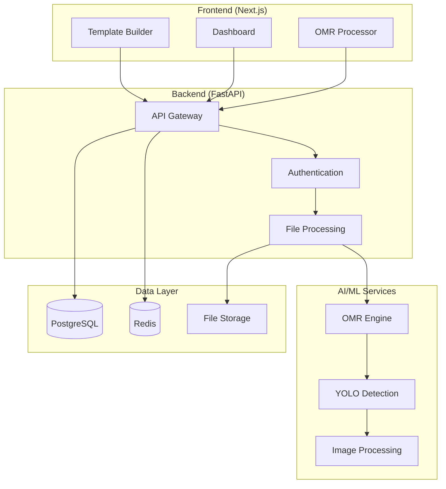

# 🎓 EduScan - Hệ thống Chấm bài tự động với AI

<div align="center">


**Hệ thống chấm bài trắc nghiệm tự động sử dụng AI và Computer Vision**

[](LICENSE)
[](docker-compose.prod.yml)
[](nginx/sites-enabled/eduscan.conf)

[🌐 Demo](#demo) • [🚀 Cài đặt](#cài-đặt) • [📖 Tài liệu](#tài-liệu) • [🛠️ API](#api)

</div>

## 📋 Tổng quan

EduScan là một hệ thống hoàn chỉnh để **chấm bài trắc nghiệm tự động** sử dụng:

- 🔬 **Computer Vision** với YOLO để detect bubbles
- 🧠 **Machine Learning** để nhận dạng OMR (Optical Mark Recognition)  
- 🌐 **Web Application** với Next.js và FastAPI
- 📊 **Analytics** và báo cáo chi tiết
- 🔐 **Security** với HTTPS và authentication

### ✨ Tính năng chính

- ✅ **Template Builder**: Tạo và chỉnh sửa templates bài thi trực quan
- ✅ **OMR Processing**: Xử lý ảnh bài thi với độ chính xác cao
- ✅ **Batch Processing**: Chấm hàng loạt bài thi cùng lúc
- ✅ **Multi-format**: Hỗ trợ nhiều định dạng bài thi khác nhau
- ✅ **Analytics Dashboard**: Thống kê và phân tích kết quả
- ✅ **Role-based Access**: Phân quyền Admin/Manager/Teacher
- ✅ **Real-time Preview**: Xem trước kết quả ngay lập tức
- ✅ **Export Results**: Xuất kết quả ra Excel, PDF

## 🏗️ Kiến trúc hệ thống



## 🚀 Cài đặt

### Quick Start (Production)

```bash
# Clone repository
git clone <repository-url>
cd Eduscan

# Chạy setup script
chmod +x production-setup.sh
./production-setup.sh

# Demo production build
chmod +x demo-production.sh
./demo-production.sh
```

### Manual Setup

#### Yêu cầu hệ thống
- **Docker** 20.10+
- **Docker Compose** 2.0+
- **OpenSSL** (để tạo SSL certificates)
- **4GB RAM** minimum, 8GB recommended
- **50GB Storage** cho uploads và database

#### 1. Environment Setup

```bash
# Tạo SSL certificates
./generate-ssl.sh

# Setup environment variables
cp .env.prod.example .env.prod
nano .env.prod  # Cập nhật passwords và secrets
```

#### 2. Build và Deploy

```bash
# Build tất cả services
docker-compose -f docker-compose.prod.yml build

# Start services
docker-compose -f docker-compose.prod.yml up -d

# Check health
curl -k https://localhost/health
```

#### 3. Database Migration

```bash
# Run database migrations
docker-compose -f docker-compose.prod.yml exec backend alembic upgrade head

# Seed initial data (optional)
docker-compose -f docker-compose.prod.yml exec backend python -m app.db.seed
```

## 🌐 Access URLs

### Production
- **Main App**: https://eduscan.local
- **API Docs**: https://eduscan.local/api/v1/docs
- **Health Check**: https://eduscan.local/health

### Development
- **Frontend**: http://localhost:3000
- **Backend**: http://localhost:8000
- **OMR Service**: http://localhost:8001

## 👥 User Roles

| Role | Permissions |
|------|-------------|
| **Admin** | Toàn quyền quản trị hệ thống |
| **Manager** | Quản lý organization, users, templates |
| **Teacher** | Tạo templates, upload bài thi, xem kết quả |

### Default Login
```
Email: admin@eduscan.vn
Password: admin123
```

## 📊 Demo

### Template Builder


### OMR Processing


### Analytics Dashboard


## 🛠️ API

### Core Endpoints

```http
# Authentication
POST /api/v1/auth/login
POST /api/v1/auth/logout
GET  /api/v1/auth/me

# Templates
GET    /api/v1/answer-templates
POST   /api/v1/answer-templates
GET    /api/v1/answer-templates/{id}
PUT    /api/v1/answer-templates/{id}
DELETE /api/v1/answer-templates/{id}

# OMR Processing
POST /api/v1/answer-templates/{id}/omr-preview
POST /api/v1/answer-templates/{id}/process-omr
GET  /api/v1/answer-templates/{id}/omr-config
```

### OMR Service API

```http
# Health Check
GET /api/omr/health

# Preview Template
POST /api/omr/preview

# Process Images
POST /api/omr/batch

# Available Models
GET /api/omr/models
```

## 🔧 Management

### Monitoring

```bash
# View logs
docker-compose -f docker-compose.prod.yml logs -f

# Check status
docker-compose -f docker-compose.prod.yml ps

# Resource usage
docker stats
```

### Backup & Restore

```bash
# Create backup
./backup-restore.sh backup

# List backups
./backup-restore.sh list

# Restore from backup
./backup-restore.sh restore backups/eduscan_backup_20240101.tar.gz

# Cleanup old backups
./backup-restore.sh cleanup
```

### Updates

```bash
# Pull latest changes
git pull origin main

# Rebuild and restart
docker-compose -f docker-compose.prod.yml build
docker-compose -f docker-compose.prod.yml up -d

# Run migrations if needed
docker-compose -f docker-compose.prod.yml exec backend alembic upgrade head
```

## 📖 Tài liệu

- [🚀 Production Deployment Guide](PRODUCTION_DEPLOYMENT.md)
- [🔧 OMR Integration Documentation](README_OMR_INTEGRATION.md)
- [🔑 Password Reset Guide](README_PASSWORD_RESET.md)
- [🏗️ Frontend Build Fixes](FRONTEND_BUILD_FIXES.md)

### API Documentation
- **Swagger UI**: https://localhost/api/v1/docs
- **ReDoc**: https://localhost/api/v1/redoc

## 🧪 Testing

### Run Tests

```bash
# Backend tests
docker-compose -f docker-compose.prod.yml exec backend pytest

# Frontend tests
cd frontend && npm test

# OMR Service tests
cd OMRChecker && python -m pytest tests/
```

### Load Testing

```bash
# Using Apache Bench
ab -n 1000 -c 10 https://localhost/api/v1/health

# Using curl for API testing
curl -k -X POST https://localhost/api/v1/auth/login \
  -H "Content-Type: application/json" \
  -d '{"email":"admin@eduscan.vn","password":"admin123"}'
```

## 🔐 Security

### SSL/TLS
- **TLS 1.2/1.3** support
- **HSTS** headers
- **Security headers** (X-Frame-Options, CSP, etc.)

### Authentication
- **JWT tokens** với refresh mechanism
- **Role-based access control**
- **Session management** với Redis

### Rate Limiting
- **Login attempts**: 5 per minute
- **API calls**: 100 per minute
- **File uploads**: Size và type validation

## 🤝 Đóng góp

1. Fork project
2. Tạo feature branch (`git checkout -b feature/AmazingFeature`)
3. Commit changes (`git commit -m 'Add some AmazingFeature'`)
4. Push to branch (`git push origin feature/AmazingFeature`)
5. Tạo Pull Request

### Development Setup

```bash
# Setup development environment
npm install
pip install -r requirements.txt

# Run development servers
npm run dev          # Frontend
uvicorn app.main:app --reload  # Backend
python app/main.py   # OMR Service
```

## 📄 License

This project is licensed under the MIT License - see the [LICENSE](LICENSE) file for details.

## 👨‍💻 Team

- **Development Team**: EduScan Team
- **AI/ML**: Computer Vision specialists
- **DevOps**: Production deployment experts

## 🙏 Acknowledgments

- [YOLO](https://github.com/ultralytics/ultralytics) for object detection
- [FastAPI](https://fastapi.tiangolo.com/) for backend framework
- [Next.js](https://nextjs.org/) for frontend framework
- [OpenCV](https://opencv.org/) for image processing

---

<div align="center">

**⭐ Star this repo if you find it helpful!**

[📝 Report Bug](https://github.com/your-org/eduscan/issues) • [💡 Request Feature](https://github.com/your-org/eduscan/issues) • [💬 Discussions](https://github.com/your-org/eduscan/discussions)

</div> 