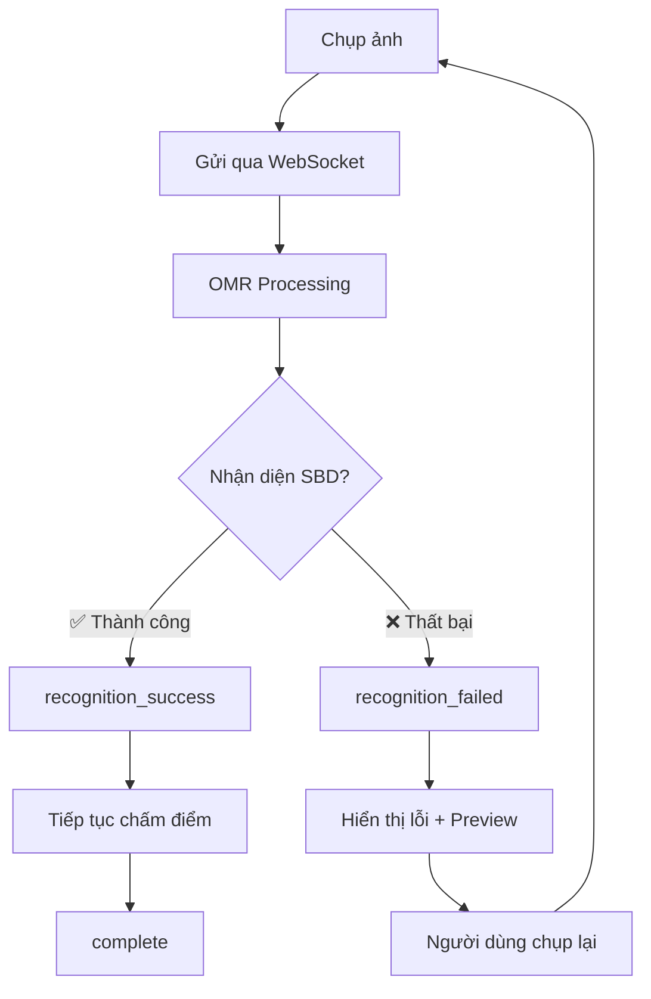

# 🔍 WebSocket SBD Validation - Hướng dẫn Frontend

## Tổng quan
WebSocket OMR đã được cập nhật để **validation nghiêm ngặt SBD** và **dừng xử lý ngay** nếu không nhận diện được.

## 📡 Các Status WebSocket Mới

### 1. ✅ `recognition_success` - Nhận diện thành công
```json
{
  "status": "recognition_success",
  "message": "✅ Nhận diện thành công SBD: 123456789",
  "details": {
    "recognition_result": "success",
    "detected_sbd": "123456789",
    "detected_ma_de": "001"
  }
}
```

### 2. ❌ `recognition_failed` - Nhận diện thất bại (DỪNG XỬ LÝ)
```json
{
  "status": "recognition_failed", 
  "message": "❌ Không nhận diện được SBD từ phiếu trả lời",
  "details": {
    "recognition_result": "failed",
    "detected_sbd": "unknown", // hoặc "Không phát hiện"
    "reason": "SBD không hợp lệ hoặc không rõ ràng",
    "suggestion": "Vui lòng chụp lại ảnh rõ nét hơn, đảm bảo vùng SBD không bị che khuất",
    "aligned_image": "data:image/jpeg;base64,/9j/4AAQ..." // Ảnh để review
  }
}
```

## 🎯 Validation Rules (Backend)

### SBD được coi là **HỢP LỆ** khi:
- ✅ Không null/undefined/empty
- ✅ Không phải "unknown"  
- ✅ Là số (isdigit() = true)
- ✅ Có ít nhất 4 chữ số

### SBD được coi là **KHÔNG HỢP LỆ** khi:
- ❌ null, undefined, empty string
- ❌ Giá trị "unknown"
- ❌ Chứa ký tự không phải số
- ❌ Ít hơn 4 chữ số

## 💻 Cách xử lý Frontend

### React/Next.js Example:
```typescript
// WebSocket event handler
socket.on('omr_progress', (data) => {
  switch(data.status) {
    case 'recognition_success':
      // ✅ Hiển thị SBD đã nhận diện
      setDetectedSBD(data.details.detected_sbd);
      setRecognitionStatus('success');
      setStatusMessage(`Nhận diện thành công: ${data.details.detected_sbd}`);
      break;
      
    case 'recognition_failed':
      // ❌ Dừng xử lý, hiển thị lỗi và ảnh preview
      setRecognitionStatus('failed');
      setStatusMessage(data.message);
      setErrorDetails(data.details);
      setPreviewImage(data.details.aligned_image);
      
      // Hiển thị nút "Chụp lại"
      setShowRetryButton(true);
      
      // Tự động reset sau 5s để người dùng thử lại
      setTimeout(() => {
        resetScanningState();
      }, 5000);
      break;
      
    case 'complete':
      // ✅ Hoàn thành chấm điểm
      setResults(data.details);
      setScanningComplete(true);
      break;
  }
});
```

### UI Components:
```jsx
function SBDRecognitionStatus({ status, detectedSBD, errorDetails }) {
  if (status === 'success') {
    return (
      <div className="recognition-success">
        <CheckIcon className="text-green-500" />
        <span>SBD: {detectedSBD}</span>
      </div>
    );
  }
  
  if (status === 'failed') {
    return (
      <div className="recognition-failed">
        <XMarkIcon className="text-red-500" />
        <div>
          <p className="text-red-600">Không nhận diện được SBD</p>
          <p className="text-sm text-gray-600">{errorDetails?.suggestion}</p>
          
          {/* Hiển thị ảnh để người dùng review */}
          {errorDetails?.aligned_image && (
            
          )}
          
          <button 
            onClick={retryCapture}
            className="mt-2 px-4 py-2 bg-blue-500 text-white rounded"
          >
            📷 Chụp lại
          </button>
        </div>
      </div>
    );
  }
  
  return <div>Đang xử lý...</div>;
}
```

## 🔄 Luồng xử lý mới



## 🎨 UI/UX Recommendations

### 1. Recognition Success State:
- ✅ Màu xanh lá
- 🏷️ Hiển thị SBD rõ ràng  
- ⏳ Loading indicator cho bước tiếp theo

### 2. Recognition Failed State:
- ❌ Màu đỏ cảnh báo
- 🖼️ Hiển thị ảnh preview để người dùng thấy vấn đề
- 💡 Gợi ý cụ thể (ánh sáng tốt hơn, không che khuất...)
- 🔄 Nút "Chụp lại" nổi bật

### 3. Auto-retry Logic:
```typescript
const MAX_RETRIES = 3;
const [retryCount, setRetryCount] = useState(0);

function handleRecognitionFailed() {
  if (retryCount < MAX_RETRIES) {
    setRetryCount(prev => prev + 1);
    // Auto retry sau 2s
    setTimeout(() => {
      captureFrame();
    }, 2000);
  } else {
    // Hiển thị hướng dẫn chi tiết
    showDetailedInstructions();
  }
}
```

## 🚀 Benefits

1. **UX tốt hơn**: Người dùng biết ngay khi nào cần chụp lại
2. **Tiết kiệm tài nguyên**: Không xử lý những ảnh không hợp lệ
3. **Độ chính xác cao**: Chỉ chấm điểm khi SBD rõ ràng
4. **Phản hồi realtime**: Status updates tức thời
5. **Debug dễ dàng**: Ảnh preview giúp hiểu vấn đề

## 📝 Testing Checklist

- [ ] Test với ảnh SBD rõ nét ✅
- [ ] Test với ảnh SBD mờ/không rõ ❌  
- [ ] Test với ảnh thiếu vùng SBD ❌
- [ ] Test với ảnh SBD bị che khuất ❌
- [ ] Verify WebSocket status messages
- [ ] Check preview image hiển thị đúng
- [ ] Test retry mechanism
- [ ] Verify không có memory leaks 